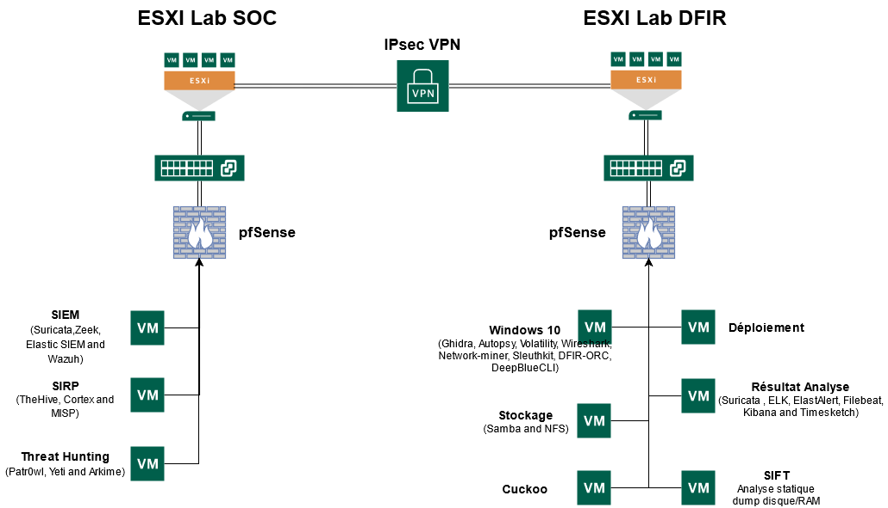

# Lab-DFIR-SOC

_Laboratoire de déploiement automatisé de VM axé DFIR & SOC_


Ce projet est encore en version alpha et beaucoup de chose reste à faire pour que ce Lab soit utilisable réellement.

l'objectif est d'avoir pour nos projets un lab avec tous les outils et techno nécéssaire pour pouvoir faire des test, des analyse forensic, de la détection etc...

Ce projet sera maintenu au fil des mois pour tendre vers un projet utilisable en production par des analyste cybersécurité.


## Groupe

- CEBERIO Pierre  **[@PierreYnov](https://github.com/PierreYnov)**
- DIAS Steven **[@StevenDias33](https://github.com/StevenDias33)**
- FEUGERE Thibault **[@thibaultfeugere](https://gitlab.com/thibaultfeugere)**
- LABORDE Simon **[@Genisys](https://github.com/Genisys33)**

Un grand merci à Kidrek pour son projet DFIR qui nous a beaucoup aidé. **[@Kidrek](https://github.com/kidrek/)**


# Sommaire 

- [Gestion de projet](#gestion-de-projet)
- [Terraform](#terraform)
- [VMs](#vms)
- [Schéma Réseau](#sch%C3%A9ma-r%C3%A9seau)
- [Configuration IPSEC](#configuration-ipsec)
    - [VPN](#vpn)
- [Description des VMs disponibles](#description-des-vms-disponibles)
    - [I. Windows 10](#i-windows-10)
    - [II. Ubuntu Threat Hunting](#ii-ubuntu-threat-hunting)
    - [III. Security Incident Response Platform](#iii-security-incident-response-platform)
    - [IV. Vm Analyste Forensic SIFT](#iv-vm-analyste-forensic-sift)
    - [V. Sandbox Cuckoo](#v-sandbox-cuckoo)
        - [Préparation de l'host](#préparation-de-lhost)
        - [Déploiement](#déploiement)
- [Installation à finir manuellement](#installation-%C3%A0-finir-manuellement)
    - [I. Arkime sur la VM Threat Hunting](#i-arkime-sur-la-vm-threat-hunting)
    - [II. Nested Virtu sur Cuckoo](#ii-nested-virtu-sur-cuckoo)


## Packer

Il faudra créer les images packer sur votre ESXI avec le `build.sh` qui se situe à la racine de chaque vm dans le dossier packer. n'oubliez pas de lui fournir les ISO s'il n'y en a pas. 


## Terraform

Une fois que les fichiers .tf sont édités, vous pouvez :

- `terraform init`
- `terraform plan`
- `terraform apply`


## Schéma Réseau



## Configuration IPSEC

Pour que les deux sites puissent communiquer nous avons fais un vpn Ipsec inter-site. La configuration de celui-ci est très simple il suffit de rentrer les même valeurs dans les phases 1 et 2 sur les deux Pfsense.

Pour la Phase 1 et 2 sur l'hyperviseur Dfir :


Il faut bien faire attention à ce que la `Pre-Shared Key` soit la même sur les deux Phase 1 entre les deux pfsense.


Ce sera au niveau de la phase deux que nous allons spécifier le network interne pour le pfsense en face.

Pour la Phase 1 et 2 sur l'hyperviseur Soc :


Une fois paramètres vérifier nous pouvons sauvegarder et spécifier à la fin de la configuration de la phase 2 qu'elle ip à ping pour s'assurer de la liaison. Nous vous conseillons de mettre l'ip de la gateway pour nous `10.10.12.254` et `10.10.13.254`.


### VPN

Pour le Serveur Vpn nous avons utilisé la vm de déploiement. Ainsi nous économisont des ressources pour les vm du lab. Le script est disponible [Ici](./Vpn-Server.sh)

## Description des VMs disponibles

### I. Windows 10

Les outils présents dessus sont :

- [Ghidra](https://ghidra-sre.org/) 
- [Autopsy](https://www.sleuthkit.org/autopsy/)
- [Volatility](https://github.com/volatilityfoundation/volatility)
- [Wireshark](https://www.wireshark.org/)
- [Network-miner](https://www.netresec.com/?page=networkminer)
- [Sleuthkit](https://www.sleuthkit.org/)
- [Dfir-ORC](https://github.com/DFIR-ORC/dfir-orc)
- [DeepBlueCLI](https://github.com/sans-blue-team/DeepBlueCLI)

> Remarque : Si lors de la première fois que vous lancez Ghidra, un cli vous demande un path, donnez-le suivant : ```C:\Program Files\OpenJDK\openjdk-11.0.10_9```

### II.  Threat Hunting

La VM de Threat Hunting à pour but de faire du Hunting sur des captures réseau et tout autres artefacts pour ne pas se laisser surprendre par les attaquants.

Les outils présents dessus sont :

- [Patr0wl](https://github.com/Patrowl/PatrowlManager) : http://10.X.X.X:8083/
- [Arkime](https://github.com/arkime/arkime) **(Installation manuelle nécessaire pour finaliser voir [ici](#ii-arkime-sur-la-vm-threat-hunting))**
- [Yeti](https://github.com/yeti-platform/yeti) : http://10.X.X.X:5000


### III. Security Incident Response Platform

La VM SIRP est une VM qui à pour but de faciliter le traitement des incident et la collaboration entre analyste pour l'investigation numérique.
Pour ce faire cette VM est composé pour le moment de 3 outils : 

- [MISP](https://www.misp-project.org/) (Malware Information Sharing Platform)
- [TheHive](https://thehive-project.org/)
- [Cortex](https://github.com/TheHive-Project/Cortex) 

Misp est une plateforme qui permet de récupérer d'autres MISP ou de liste publique des informations sur des IOC des menaces des payload et tout ce qu'un analyste SOC aurait besoin pour faire de la corrélation sur des event, par exemple il peut récupérer des informations sur les Exit node de TOR pour faire une corrélation avec les IP qui ont tenté de scanné le SI qui est surveiller. 

The Hive est une plateforme collaboratif qui permet de traiter des evenement de sécurité sous forme de Cases et de donner des taches à des analyste. 
Avec l'utilisation de Cortex on peut lancer depuis the hive des analyseurs comme virus total, cuckoo qui vont aller récupérer des informations sur des payload, des ip des url, tout type d'information que le SIEM aura récupéré pour pouvoir faire la réponse incident sur cette alerte. 


### IV. Vm Analyste Forensic SIFT

Pour notre VM forensic sur Linux nous somme partis sur une base SIFT Workstation qui est la VM fourni par le SANS qui est bien fournis en outils et qui permet d'avoir à dispo tout ce qu'il faut pour mener une investigation numérique sur des prélevement RAM et disque. 
Pour le déploiement automatique il faudra aller télécharger sur le site du SANS la VM et la placer dans le repertoire DFIR/déploiement pour que le déploiement automatique s'effectue.

[VM SIFT](https://digital-forensics.sans.org/community/downloads)

### V. Sandbox Cuckoo

La machine Cuckoo va nous permettre de lancer, ou de vérifier si le fichier envoyé ne contient un virus via des PID génériques ou des règles YARA. Cuckoo est majoritairement fait en python2.7, ce qui en fait son plus gros soucis. Le python2.7 étant dépricié depuis peu, il arrive que des librairies ressortent des erreurs. Pour contrer les soucis de conflit de dépendances tout sera installé dans un environnement Virtuel.

#### Préparation de l'host

Pour le déploiement de la Vm cuckoo il sera nécessaire de savoir sur quel Os nous voulons partir. De notre côté nous avons choisi un vm Windows 10. La création de la vm a été faite avec l’outil packer qui va venir suivre les instructions spécifier dans le fichier `.xml`

```
.
├── Autounattend.xml
├── build.log
├── build.sh
├── drivers
│   └── virtio-win.iso
├── files
│   ├── cuckoo_agent.py
│   ├── secubian-vmware-share-automount
│   └── winlogbeat-sandbox.yml
├── scripts
│   ├── chocolatey.ps1
│   ├── disable-screensaver.ps1
│   ├── disable-windowsDefender.bat
│   ├── disable-windows-update.ps1
│   ├── disable-winrm.ps1
│   ├── enable-winrm.ps1
│   ├── fixnetwork.ps1
│   ├── install-FTKImager.ps1
│   ├── install-zimmermantools.ps1
│   ├── microsoft-updates.bat
│   ├── Readme.md
│   ├── rearm-windows.ps1
│   ├── Set-SysmonSettings.ps1
│   ├── Set-WindowsTelemetrySettings.ps1
│   ├── vmware-tools.ps1
│   └── win-updates.ps1
├── win10.json
└── windows10-enterprise.iso
```

La création de la vm peut prendre un certain temps, suivant la machine sur laquel nous travaillons ainsi que la connexion internet. Il faut environ compter 20 ~ 30 pour une installation.

```bash
export PACKER_LOG=1; packer build win10.json | tee build.log
```

Tous les fichiers présents dans le répertoire `scripts` vont être ajoutés à la vm et exécuté pour être implanté à la vm.

Pour le déploiement il est préférable d’avoir l’image sur une machine dans le même réseau, ainsi là l’envoie sur la vm sera plus rapide. Si vous souhaitez la provisioner avec terrform il faut faire attention à avoir l’espace dans le dossier `/tmp/`. Dans notre cas nous avons généré une clef RSA, pour passer par `scp`.

#### Déploiement

Pour le déploiement il suffit de faire un `terraform apply -auto-approve`. Normalement tout va se dérouler automatiquement.

```
./
├── CONF
│   ├── Cuckoo
│   │   ├── auxiliary.conf
│   │   ├── kvm.conf
│   │   └── reporting.conf
│   ├── id_rsa
│   ├── id_rsa.pub
│   └── systemd
│       ├── cuckoo.service
│       └── cuckooweb.service
├── main.tf
├── output.tf
├── README.md
├── SCRIPTS
│   ├── cuckoo_install_kvm.sh
│   ├── cuckoo.sh
│   ├── cuckooweb.sh
│   └── cuckoo-win10.sh
├── variables.tf
└── versions.tf
```

### VI. VM Stockage

Cette VM à pour but de stocker les Evidences de tous les analyste cela permet de ne pas corrompre les preuves et de tout rassembler au même endroit.
De plus on notera la présence de quelques Ebook du SANS qui sont de très bonne qualité.

Pour ce faire il y'a un SAMBA d'installer avec un dossier Evidences ou seront stocké les DUMP RAM et disque pour tous les analystes sur le réseau.


## Installation à finir manuellement

### I. Arkime sur la VM Threat Hunting

Mettez-vous dans la direction d'arkime : ```cd arkime```

Puis : ```sudo make config``` 

Sélectionnez l'interface **eth0**
Entrez **yes** pour l'installation d'Elasticsearch et **no** pour la question sur password-encrypt. Enfin entrez **yes**.
ES est maintenant installé.

Démarrez le service : ```sudo systemctl start elasticsearch.service```

On initialise ensuite Arkime : ```/opt/arkime/db/db.pl http://localhost:9200 init```

On définit le nom d'utilisateur et le mot de passe : ```/opt/arkime/bin/arkime_add_user.sh admin "Admin User" mdptropsecure --admin```

On démarre les services :

    sudo systemctl start arkimecapture.service
    sudo systemctl start arkimeviewer.service

Vous pouvez maintenant accéder à Arkime depuis http://10.X.X.X:8005/ avec comme nom d'utilisateur **admin** et le mot de passe quoi vous avez choisi (ici **mdptropsecure**).

### II. Nested Virtu sur Cuckoo

Une fois le déploiement automatique terminé, la vm devrait s'éteindre tout seul une fois terminé il faut aller dans les options de la vm à travr le provider ( ESXI pour nous ) :


Ainsi nous activerons la nested virtu à travers cette vm. Il ne nous reste plus que à rallumer la vm et lancer cette ligne de commande : 

```bash
sudo bash ./cuckoo-win10.sh
```

Ainsi nous ajouterons la vm Windows 10 au libvirt interne à la machine.  Grâce à la manipulation précédente nous pourrons la lancer sans soucis.
